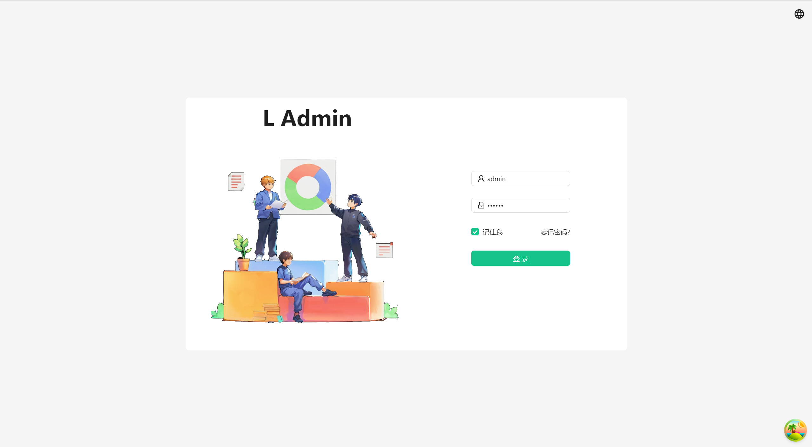

<div align="center"> 
  
  <h3>L Admin</h3>
    <p style="font-size: 14px">
      L Admin is a simple admin system template built with React 18, Vite, Ant Design, TailwindCss, @Reduxjs/Toolkit, @Tanstack/ReactQuery, Ahooks, FramerMotion, Recharts, and TypeScript.
    </p>
  <br />
</div>

**English** | [中文](./README.zh-CN.md)

## Features
- Built using React 18.
- Permission control: menu display, route permission, button permission.
- Customizable theme, support for dark mode.
- Mocking solution based on vite-plugin-mock.
- State management using @reduxjs/toolkit.
- Data fetching using @tanstack/react-query.
- Animation using framer-motion.
- Charts using recharts.
- Hooks library using ahooks.

## Getting started

```bash
npm i
npm run dev
```

Open [http://localhost:5173](http://localhost:5173) with your browser to see the result.

## Preview images




## Online preview

Preview url: [https://l-admin.pages.dev](https://l-admin.pages.dev)