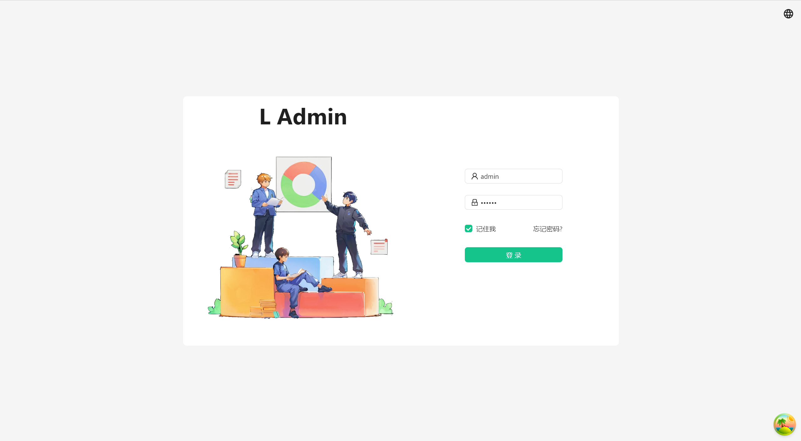
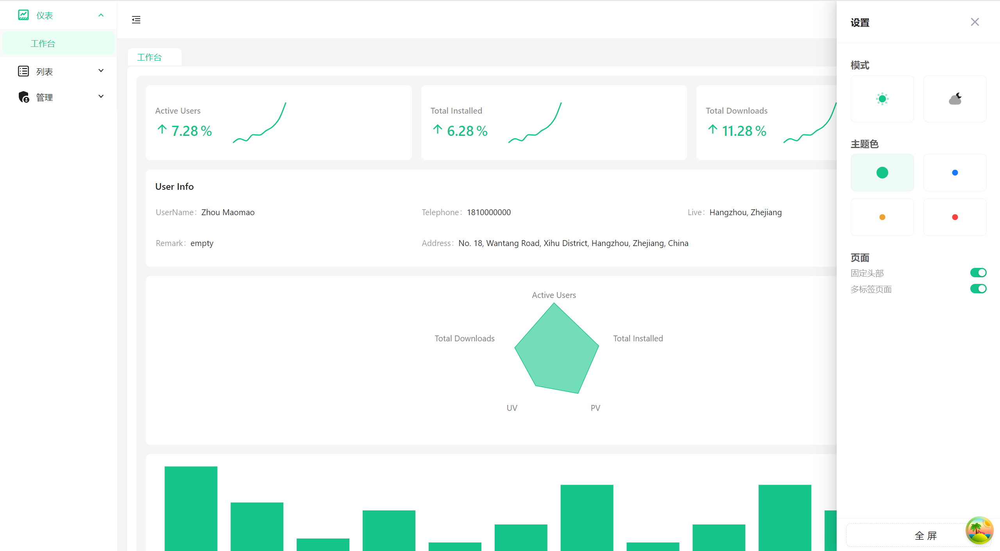

<div align="center"> 
  
  <h3>L Admin</h3>
    <p style="font-size: 14px">
      L Admin是一个简单的后台管理系统模板, 使用React 18, Vite, Ant Design, TailwindCss, @Reduxjs/Toolkit, @Tanstack/ReactQuery, Ahooks, frammotion, Recharts和TypeScript构建。
    </p>
  <br />
</div>

**中文** | [English](./README.md)

## 特性

- 使用React 18构建。
- 权限控制：菜单显示、路由权限、按钮权限。
- 可自定义主题, 支持暗黑模式。
- 基于vite-plugin-mock的模拟解决方案。
- 使用@reduxjs/toolkit进行状态管理。  
- 使用@tanstack/react-query获取数据。
- 使用帧运动的动画。
- 使用重绘制图表。
- Hooks库使用Hooks。

## 开始

```bash
npm i
npm run dev
```

用浏览器打开 [http://localhost:5173](http://localhost:5173) 查看结果。

## 预览图片




## 在线预览

预览地址: [https://l-admin.pages.dev](https://l-admin.pages.dev)
